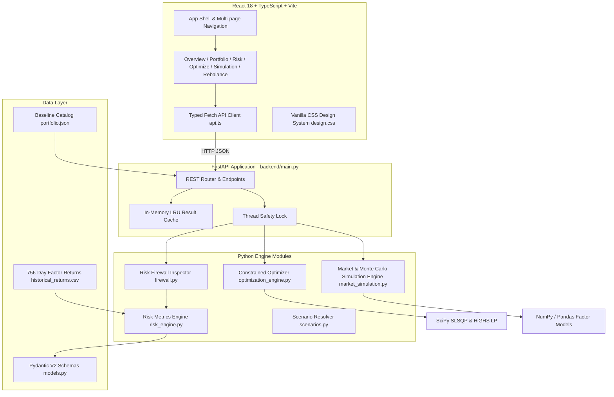

# AEGIS — Technical Architecture Document

## 1. System Overview

**AEGIS** (The Capital Compass & Institutional Risk Firewall) is a high-performance portfolio risk management, stress-testing, and capital allocation optimization platform. 

The architecture consists of a **FastAPI (Python 3.9+) analytical engine** connected to a **React 18 + TypeScript multi-page frontend**. The platform features real-time risk control evaluations, two-phase constrained quadratic portfolio optimization, factor-based return simulation, Monte Carlo stress testing, and capital routing algorithms.

---

## 2. Component Architecture

### 2.1 Backend Subsystems (`backend/`)

#### 1. API Controller (`backend/main.py`)
- **FastAPI REST API**: Serves endpoints for portfolio management, live risk reporting, limit configuration, optimization, scenario simulations, capital routing, and asset creation.
- **LRU In-Memory Caching**: Caches `/api/risk` and `/api/optimize` evaluation results. Automatically invalidates caches whenever portfolio allocations or risk limits are mutated, delivering **< 1ms** cached response times.
- **Thread Safety**: Uses Python `threading.Lock` to guarantee atomic operations across requests.

#### 2. Risk Firewall & Metrics Engine (`backend/firewall.py`, `backend/risk_engine.py`)
- **Safety Score (0–100)**: Evaluates weighted portfolio health across 5 risk components:
  1. Volatility relative to 30% ceiling (25%)
  2. Value at Risk (VaR) & Conditional VaR (25%)
  3. Concentration Risk / Herfindahl-Hirschman Index HHI (20%)
  4. Portfolio Illiquidity Score (15%)
  5. Control Limit Violations & Warnings (15%)
- **Tail Risk Metrics**: Computes annualized volatility ($\sqrt{252 \cdot w^T \Sigma w}$), 95% 1-day Value at Risk (VaR), Conditional VaR (CVaR / Expected Shortfall), and Maximum Drawdown.
- **Policy Inspection**: Evaluates 7 configurable institutional limits (Single Asset Cap, Asset Class Cap, Volatility Floor/Cap, VaR Limit, CVaR Limit, Minimum Liquidity, Minimum Cash, Turnover Budget).

#### 3. Constrained Capital Optimizer (`backend/optimization_engine.py`)
- **Phase 1 (Linear Feasibility)**: Uses `scipy.optimize.linprog` with the **HiGHS** LP solver to check feasibility under capital conservation, asset bounds, class caps, liquidity floors, cash reserves, and turnover constraints.
- **Phase 2 (SLSQP Variance Minimization)**: Minimizes portfolio historical variance ($w^T \Sigma w + \text{tx\_cost penalty}$) subject to non-linear Risk Firewall policy margins using Sequential Least Squares Programming (`SLSQP`).
- **Dust Trade Removal**: Automatically locks sub-threshold trades (< ₹1,000) and re-solves allocation to avoid fractional micro-trades.
- **Explainable Trade Rationale**: Generates human-readable trade instructions (`BUY`, `SELL`, `HOLD`) paired with the exact policy constraint trigger for each trade.

#### 4. Market & Monte Carlo Simulation Engine (`backend/market_simulation.py`, `backend/simulation_engine.py`)
- **Stress Engines**: Supports Historical, Monte Carlo, and Hybrid stress simulations over user-defined time horizons (10 to 252 days).
- **Factor Return Model**: Generates synthetic factor return series for dynamically added assets using loading vectors across Market, Interest Rates, Commodity factors, and idiosyncratic noise.

---

### 2.2 Frontend Subsystems (`frontend/src/`)

#### 1. Multi-Page HTML Shell (`frontend/src/ReportPages.tsx`, `App.tsx`)
- Multi-page routing across 6 HTML entry files:
  - `/index.html`: Executive Overview & KPI Dashboard
  - `/portfolio.html`: Portfolio Holdings, Add Asset, CSV/JSON Import, Capital Routing
  - `/risk.html`: Risk Firewall Controls & Appetite Presets
  - `/optimize.html`: Portfolio Allocation Optimization & Cost-Benefit Analysis
  - `/simulation.html`: Stress Lab & Monte Carlo Simulator
  - `/rebalance.html`: Intervention Plan & Trade Execution Export
- **State Management**: React `useState` / `useEffect` synchronized with `sessionStorage` for active simulation state and decision event audit history.

#### 2. Design System (`frontend/src/design.css`)
- **Theme Aesthetics**: Premium editorial financial design system built with CSS variables (`--paper`, `--paper-deep`, `--ink`, `--brown`, `--ochre`, `--rust`).
- **Scroll Reveal Animations**: Dynamic `IntersectionObserver` observing headings, card metric rows, charts, and tables, applying hardware-accelerated glide-up (`translateY(28px) -> translateY(0)`) and fade-in transitions.
- **Responsive Layout**: Mobile-first responsive grids and media queries.

#### 3. Asset & Data Import Subsystem
- **CSV & JSON Parser**: Client-side parser for importing portfolio datasets directly or via file upload (`.csv`, `.json`).
- **Sample CSV Generator**: Instant download of pre-formatted CSV template files (`aegis_holdings_import_template.csv`).

---

## 3. Data & API Architecture

### 3.1 REST API Endpoint Map

| Method | Endpoint | Description |
|---|---|---|
| `GET` | `/api/portfolio` | Returns active portfolio holdings & total value |
| `POST` | `/api/portfolio` | Updates target asset weights & assumptions |
| `POST` | `/api/portfolio/add-asset` | Dynamically registers new asset with synthetic return generation |
| `POST` | `/api/portfolio/route-capital` | Routes incoming capital to repair liquidity before allocating |
| `GET` | `/api/risk` | Evaluates live portfolio risk score, tail metrics & control statuses |
| `GET` | `/api/risk/limits` | Fetches active Risk Firewall limits |
| `POST` | `/api/risk/limits` | Updates Risk Firewall limits |
| `GET` | `/api/risk/appetites` | Returns Conservative, Balanced, and Growth limit presets |
| `POST` | `/api/optimize` | Runs HiGHS + SLSQP solver and returns verified rebalance plan |
| `GET` | `/api/simulations` | Lists 8 predefined market stress scenarios |
| `POST` | `/api/simulate` | Executes predefined market stress scenario |
| `POST` | `/api/simulate/custom` | Executes custom factor shock scenario |
| `POST` | `/api/simulate/withdrawal` | Simulates capital/liquidity withdrawal scenario |
| `POST` | `/api/simulate/market` | Runs Monte Carlo / Historical time-series simulation |
| `POST` | `/api/reset` | Restores baseline portfolio and limit state |

---

## 4. Build & Performance Architecture

1. **Vite Code Splitting**:
   - `vite.config.ts` uses Rollup `manualChunks` to split vendor dependencies:
     - `vendor`: React core
     - `charts`: Recharts visualization library
     - `icons`: Lucide icon set
   - Reduces main JS bundle size from 725 kB down to 301 kB (**> 58% reduction**).

2. **Non-Blocking Asynchronous Data Fetching**:
   - Initial application load fetches portfolio, risk report, and limit snapshots in parallel.
   - Optimization proposals are loaded asynchronously without blocking initial rendering.

3. **Backend Response Caching**:
   - In-memory caching for `/api/risk` and `/api/optimize` achieves **< 1ms** response time on repetitive queries.
